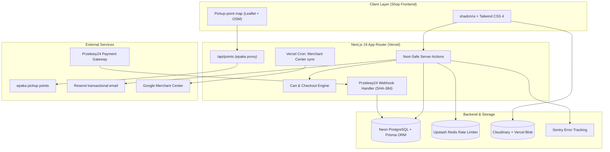

# Well Botany — E-Commerce Platform

[](https://github.com/danylo-morhun/wellbotany/actions/workflows/ci.yml)
[](https://nextjs.org/)
[](https://react.dev/)
[](https://www.prisma.io/)
[](https://www.przelewy24.pl/)
[](https://biomejs.dev/)
[](https://www.typescriptlang.org/)

A production e-commerce platform specializing in bio-products, dietary supplements, and health items. Built with **Next.js 16 (React 19)**, **Prisma ORM**, **Neon Serverless PostgreSQL** and the **Przelewy24 Gateway**, deployed on **Vercel** (fra1).

---

## System Architecture



---

## Key Engineering & Security Specs

### 1. Financial Webhook Integrity & Timing-Safe Security
- **SHA-384 Signature Verification**: Przelewy24 payment notifications are verified against a SHA-384 signature built with the merchant CRC key.
- **Timing-Safe Comparison**: Webhook signature verification uses constant-time byte comparisons to eliminate side-channel timing attacks.
- **Idempotent Order Transitions**: State transitions from `PENDING` to `PAID` are wrapped in atomic database transactions, preventing double-processing on network retries.

### 2. Shipping, Pricing & Feeds
- **Pickup-Point Checkout**: Paczkomat / Orlen points are picked on an own Leaflet map fed by `/api/points` (server-side proxy to epaka); courier and in-store pickup are also supported. Fulfilment is manual.
- **Omnibus Price History**: A PostgreSQL trigger records every price change and maintains the 30-day lowest price shown next to promotions (EU Omnibus Directive).
- **Google Merchant Center Sync**: Product feed plus price/availability pushes after admin edits and a daily Vercel Cron reconciliation.

### 3. Health & Regulatory Compliance (GIS / EU 432/2012)
- Dedicated database modeling for dietary supplement labeling, active ingredients, dosage warnings and unit prices; health claims are restricted to verbatim EU 432/2012 wording.
- Strict XSS protection using `sanitize-html` for product descriptions and rich-text specifications.

---

## Technical Decisions & Trade-Offs

| Engineering Choice | Alternative Considered | Rationale & Architectural Trade-off |
| :--- | :--- | :--- |
| **Prisma ORM + Neon** | Drizzle / TypeORM | Selected Prisma for strong type generation across complex e-commerce relational schemas (Orders, Variants, Coupons, Customers, Audit Logs). |
| **Next-Safe-Action** | Native `useActionState` | Provides type-safe server action inputs/outputs with built-in Zod schema validation and global error handling. |
| **Upstash Redis** | Self-hosted Redis | Serverless rate limiting (`@upstash/ratelimit`) on checkout endpoints and API routes without managing infrastructure. |
| **Ephemeral Neon Branches in CI** | Shared Staging DB | GitHub Actions provisions an isolated Neon Postgres branch per CI run to apply migrations, run unit tests and a production build against real data without race conditions. |

---

## Testing & Quality Assurance

- **Unit Tests (Vitest)**: Tests financial calculations, Przelewy24 signatures, timing-safe string comparison, unit prices and catalog logic.
- **E2E (Playwright)**: Checkout flows across shipping and payment methods, invoices, logged-in customers and admin order handling (desktop + mobile), run against a dev database.
- **Ephemeral Database Testing**: CI spins up isolated Neon Postgres branches automatically for every PR run.

### Running Tests Locally

```bash
# Run Unit Tests
pnpm exec vitest run tests/unit

# Run Typecheck & Biome Linter
pnpm tsc --noEmit
pnpm lint
```

---

## Local Setup

### 1. Clone & Install
```bash
git clone git@github.com:danylo-morhun/wellbotany.git
cd wellbotany
pnpm install
```

### 2. Database Migration & Development Server
```bash
# Copy env template (Next.js and Prisma CLI both read .env);
# point DATABASE_URL / DIRECT_URL at a dev Neon branch, never production
cp .env.example .env

# Generate Prisma Client & apply migrations
pnpm db:generate
pnpm exec prisma migrate deploy

# Start Next.js dev server
pnpm dev
```
Open [http://localhost:3000](http://localhost:3000) in your browser.

---

## License

MIT © Danylo Morhun
